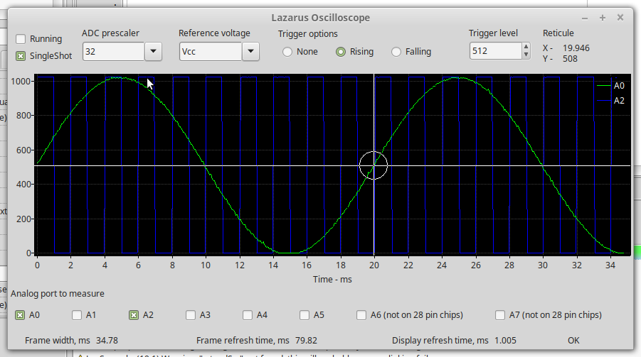
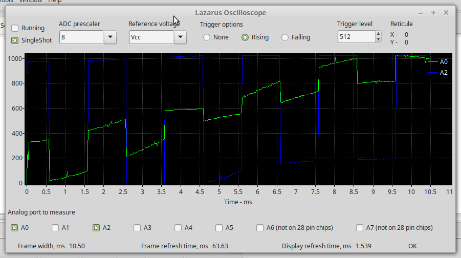

# LazScope
FPC/Lazarus serial oscilloscope
A simple oscilloscope project which reads ADC data buffers from an Arduino Uno (can be adapted for other AVR controllers) via a serial connection.  This data gets displayed on a PC screen via a FPC/Lazarus GUI.

## Firmware
The ADC prescaler gets configured via the GUI to a value in the range 2 ... 128.  This prescaler divides the controller clock which drives the ADC. The Arduino Uno runs at 16 MHz, resulting in a sample acquisition time of around 1.6 to 100 microseconds. Note that the atmega328p datasheet recommends a limit of 200 kHz clock to the ADC (about 65 microseconds acquisition time) to achieve maximum accuracy.  A prescaler of 64 is slightly beyond the specification, but still gives excellent visual preformance, even a prescaler of 32 looks visually OK.

The firmware implements elementary trigger functionality.  Either a rising or falling slope with a threshold value can be selected.  The trigger logic takes a significant amount of time relative to the sample time, hence the decision to only trigger at the start.  This means that the interval between the 1st and 2nd data point may be slightly longer than subsequent intervals due to this.

The ADC produces 10 bit results.  To preserve this precision and to reduce data storage space a sample point is stored in 12 bits.  This results in 3 bytes storage required per 2 samples.  The data is stored as follows:
The first sample is left aligned so that the right-most 6 bits of the 2nd byte is unused.  The 2nd sample is the stored right aligned, with the high 2 bits stored in the 2nd byte and the low 8 bits stored in the 3rd byte. This leaves 4 bits unused which is a compromise between data storage efficiency and computational effort to pack the samples.

Multiple ADC channels can be selected.  The firmware will then cycle the multiplexer through the channels in fixed sequence.

### Square wave generator
A square wave signal of 500 Hz is generated on PD3/Arduino D3 pin. Very handy if one has a need to measure a signal in a hurry.

## Software
The GUI consist of a display thread (main thread) and a serial thread to handle asynchronous communication with the firmware.  The general communication protocol is based on a request/response model, with the main thread sending requests to the serial thread, which dispatches a single message and wait for a response.  If the request doesn't return data, the command itself is echoed back.  When a user selects an option, the main thread will post a message to a command queue in the serial thread.  If the serial thread receives a data packet it is stored in raw format in a temporary buffer in the serial thread.  A message is posted to the main form to flag data availability.  The main thread will then unpack the data, extract the time for the data packet and perform a checksum test to detect data consistency errors.

A reticule ("crosshair") tool is available which will snap to the nearest data point and display its coordinates.  Activate this by pressing the Alt button while moving the mouse cursor.
 
### TODO
The serial port and baud rate is currently hardcoded - must put this in the GUI so user can configure this!!!

## Examples
Some signals were generated on a signal generator similar to this one (https://scienceprog.com/avr-dds-signal-generator-v20/)

### 50 Hz sine wave + 500 Hz square wave sampled at x32 prescaler
A decent quality trace of the two signals.

### 50 Hz sine wave + 500 Hz square wave sampled at x8 prescaler
A poor quality trace caused by to high a sampling frequency. At too high sampling frequencies the ADC charge capacitor cannot be fully charged/discharged between sample cycles, leading to smearing samples.  In this case the alternating sampling caused channel A0 to affect A2's reading and visa versa.

